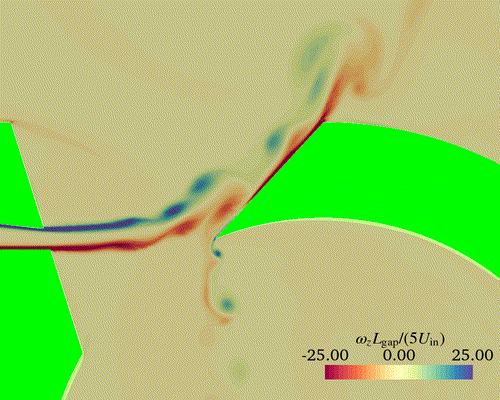

# whistle-noise

Repository with the complete numerical setup for the direct noise simulation of 
a sports whistle based on OpenFOAM.

Execute `bash launch.sh` to run the simulation.

Folders:

- **case**: OpenFOAM case
- **mesh**: script for Gmsh mesh generation with python API + yml files with the parameters
- **model**: FreeCAD file with the model and script to extract the coordinates of interest

## Disclaimer

This setup is not validated and not fully tested. No convergence study was
performed and selected models may not be the best.

### Known limitations and aspects to improve

- Setup can be improved in terms of sponge zones and domain size.
- Mesh is most probably too fine for URANS and too coarse for LES, need to check.
- Geometry is simple enough that a fully structured mesh can be envisioned.
  The use of a fully quad/hexa mesh is also recommended.
- Numerical scheme can probably be improved, not everything is second order.
- Direct noise is simulated, mesh could be reduced by reducing the size of the
  domain and combining it with propagation models.

## TODO

- upload the post-processing scripts
- add dependencies list